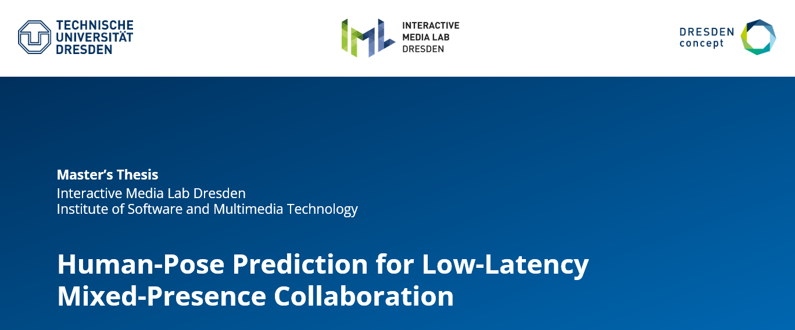

# Human-Pose Prediction for Low-Latency Mixed-Presence Collaboration

Mixed Presence Collaboration (MPC) systems facilitate seamless interaction between co-present and remote participants but face challenges such as presence disparity, where collaborators’ sense of each other’s presence varies. Immersive displays like AR and VR address this by offering embodied representations of remote collaborators, enhancing shared space and co-presence. A key enabler of this is real-time human motion tracking, which captures gestures and movements for lifelike interaction. However, tracking technologies often introduce latency, which combined with the inherent networking delays in distributed systems like MPC systems, disrupts natural interactions and diminishes collaboration effectiveness.

This master’s thesis aims to address the aforementioned latency issue in MPC systems by integrating a 3D human pose prediction model, specifically the STS-GCN model. It begins with an exploration of the literature and the related work. The focus then shifts to the design, architecture and technical implementation of integrating the pose prediction model into an existing MPC system. This is followed by an evaluation of the prediction accuracy of the integrated pose prediction model through both qualitative visualizations and quantitative metrics. The model’s performance is compared against the zero-velocity baseline model. The results indicate that while the model currently lags behind the zero-velocity baseline, it shows promise. With further fine-tuning, it could achieve better accuracy, particularly for dynamic and complex movements. Although the reduction in latency was not empirically tested, the design provides a theoretical contribution by offering a framework for future testing and validation of latency improvements in real-time MPC systems.

Finally, based on the work done in this master’s thesis to utilize a pose prediction model with live tracking data for real-time applications, valuable insights are provided that serve as a foundation for future research on using pose prediction to mitigate latency in MPC systems.